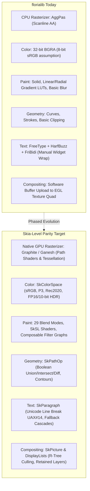
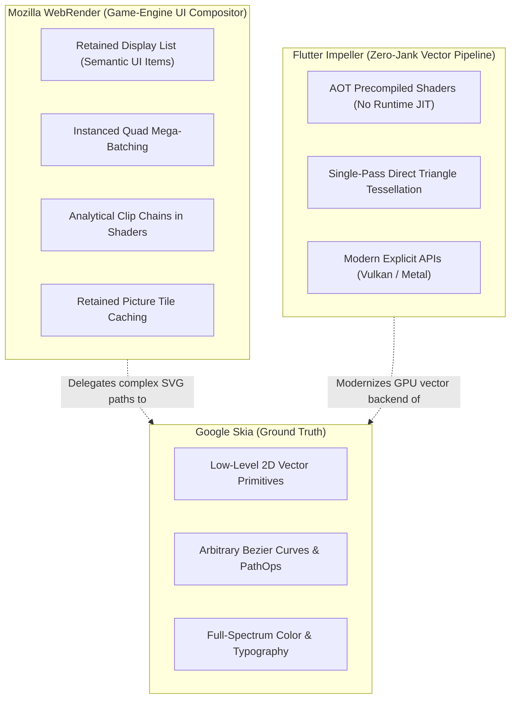
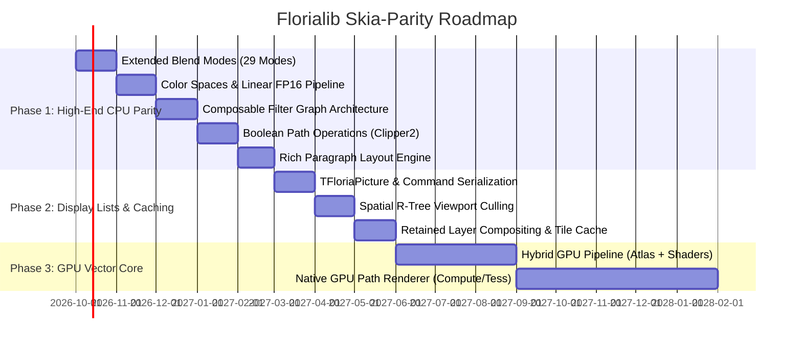

# Floria Graphics Architecture Roadmap: Evolution Toward Skia-Level Parity

## 1. Executive Summary & Vision

The objective of this roadmap is to establish a clear, phased engineering strategy to evolve **`florialib`**'s rendering and typography foundations (`Floria.Canvas.*`, `Floria.Font.*`, `Floria.SVG.*`) and **Floria Toolkit (`ft`)** into an industrial-grade 2D graphics engine comparable in capabilities and performance to **Google Skia** (the engine powering Chromium, Android, Flutter, Firefox, and Avalonia).

Today, `florialib` boasts a solid foundation:
- **`AggPas:2.4.0`**: A mathematically rigorous, sub-pixel accurate CPU 2D vector rasterizer decoupled from legacy frameworks.
- **Modern Typography Pipeline**: FreeType glyph caching, HarfBuzz text shaping (`Floria.Text.HarfBuzz`), and FriBidi bidirectional reordering (`Floria.Unicode.BiDi`).
- **W3C CSS & SVG Engines**: Complete push tokenizers, AST, selector matching, cascade solvers, and SVG path rasterization.
- **Hardware Presentation**: EGL 1.4/1.5 and OpenGL ES 2.0 streaming pipeline (`Ft.Backend.EGL`).

However, reaching "Skia level" requires overcoming architectural bottlenecks: transitioning from immediate-mode CPU rasterization to **retained display lists**, **native GPU path rendering**, **true color space pipelines (HDR/Linear sRGB)**, **arbitrary boolean path operations**, and **composable filter graphs**.

---

## 2. Architectural Comparison: Florialib vs. Google Skia

### Detailed Domain Gap Matrix

| Capability Domain | `florialib` Current State | Google Skia Benchmark | Gap Severity | Target Milestone |
| :--- | :--- | :--- | :--- | :--- |
| **Vector Rasterization** | CPU scanline rasterization via AggPas. | GPU path rasterization via compute shaders and tessellation (Ganesh/Graphite). | **Critical** | Phase 3 |
| **Color Spaces & HDR** | Fixed 32-bit BGRA (`TBgraPixel`, 8bpc), implicit gamma 2.2 approximation. | Arbitrary color spaces (`SkColorSpace`), ICC profiles, FP16 linear, 10-bit HDR, gamut mapping. | **High** | Phase 1 |
| **Blend Modes** | Porter-Duff `SrcOver`, alpha-blended strokes. | 29 Blend Modes (12 Porter-Duff + 17 Photoshop/W3C modes like Multiply, Screen, Overlay). | **Medium** | Phase 1 |
| **Shaders & Filter Graphs** | Linear and radial gradient LUTs, box blur, drop shadow generator. | Composable filter trees (blur, color matrix, lighting, morphology) + SkSL runtime shaders. | **High** | Phase 1 & 2 |
| **Path Geometry & Ops** | Path storage, cubic/quadratic beziers, stroke expansion, affine transforms. | Boolean path operations (`SkPathOp`: Union, Difference, Intersect, XOR), contour simplification. | **High** | Phase 1 |
| **Text & Typography** | FreeType + HarfBuzz + FriBidi glyph runs. Manual widget line wrap. | Multi-style rich text paragraph engine (`SkParagraph`), UAX #14 line breaking, font fallback chains, variable fonts, color emoji (COLR/CPAL). | **High** | Phase 1 |
| **Scene Graph & Caching** | Immediate mode rasterization into window buffer with dirty rectangles. | Retained command recording (`SkPicture`), spatial R-Tree indexing, thread-safe replay, layer tile caching. | **High** | Phase 2 |
| **Hardware Backends** | X11/XCB with EGL/OpenGL ES 2.0 texture streaming. | Vulkan, Metal, Direct3D 12, OpenGL ES, WebGPU. | **Medium** | Phase 3 |

### 2.2 The Modern Rendering Landscape: Google Skia vs. Flutter Impeller vs. Mozilla WebRender

To build a world-class 2D graphics and desktop UI stack in pure Object Pascal and GLSL/Vulkan, we synthesize the key architectural breakthroughs of three major modern graphics engines:

1. **Google Skia**: Our functional benchmark for **mathematical and colorimetric completeness** (29 blend modes, arbitrary color spaces, Clipper2 path ops, HarfBuzz typography, and high-precision software scanline ground truth).
2. **Flutter Impeller**: Our modern blueprint for **zero-jank GPU vector execution** (100% AOT precompiled shaders with static PSOs, eliminating runtime shader compilation pauses, and direct single-pass triangle strip tessellation).
3. **Mozilla WebRender**: Our blueprint for **high-throughput retained desktop UI compositing** (treating UI like 3D game geometry, instanced mega-batching, analytical clip chains in fragment shaders, picture tile caching, and delegating complex arbitrary vector paths to a fallback blob rasterizer).

#### The Triangle of Modern 2D Graphics Engines

#### Multi-Engine Architectural Matrix

| Architectural Dimension | Google Skia (Ganesh) | Flutter Impeller | Mozilla WebRender | Florialib Target Architecture |
| :--- | :--- | :--- | :--- | :--- |
| **Primary Domain** | Universal 2D (Browsers, OS compositors, PDF, print). | Reactive mobile/desktop UI (Flutter). | Web browser viewport rendering (Firefox Quantum/Servo). | Desktop desktop environment (`shellsama`) & widget toolkit (`ft`). |
| **Shader Lifecycle** | **Runtime JIT via SkSL**: Generates shaders on demand; causes 50–200ms frame drops on first draw. | **100% Ahead-Of-Time (AOT)**: All shaders compiled offline; static PSOs. Zero runtime shader compilation. | **AOT Mega-Shaders**: Fixed, bounded set of uber-shaders with uniform buffer parameters. | **100% AOT Precompiled Shaders**: Zero runtime JIT compilation jank on desktop GPUs. |
| **Path Rendering** | **Stencil-and-Cover**: Multi-pass stencil buffer or CPU mask atlas blits. | **Direct Tessellation**: Decomposes paths to triangle strips with analytic AA. | **Fallback Blob Rasterizer**: Skia rasterizes complex SVG paths to texture cache; WebRender composites. | **Impeller + WebRender Hybrid**: Direct tessellation for common paths; AggPas CPU blob cache for arbitrary complex SVGs. |
| **UI Primitive Handling** | Treats all drawing as low-level procedural canvas strokes/fills. | Retained `EntityPass` tree with vertex generation. | **The 95/5 Rule**: 95% of UI (rects, rounded corners, borders, shadows, text) are instanced GPU quads. | **95/5 Rule**: Instanced quads + SDF shaders for UI primitives; AggPas for 5% complex vector art. |
| **Clipping Strategy** | Allocates offscreen FBOs or GPU stencil masks. | Stencil or clip geometry bounding hulls. | **Analytical Clip Chains**: Passes stack of rounded clip boxes to shader; shader discards or computes AA coverage. | **Analytical Clip Chains**: Zero offscreen FBO allocation for nested rounded rect clipping. |
| **Pass Compositing** | Immediate mode stream; dynamic `saveLayer()` FBO switches. | Retained pass tree with pass reordering. | **Retained Picture Caching**: Breaks viewport into cached GPU tiles; scrolling only updates transform matrix. | **Retained `TFloriaTileCache`**: Zero-CPU-rasterization scrolling and window dragging in `shellsama`. |

#### 5 Architectural Tenets Adopted for Florialib:

1. **The "95 / 5 Rule" of Desktop UI (from WebRender)**:
   - 95% of desktop UI elements (window frames, buttons, taskbar panels, borders, text labels, drop shadows) are **regular analytical geometric shapes**, not arbitrary beziers.
   - We do not run CPU scanlines for simple rounded boxes or shadows: an instanced quad evaluated in a fragment shader with a Signed Distance Field (SDF) renders anti-aliased rounded boxes and blurs at 1,000+ FPS with zero CPU overhead.
2. **Analytical Clip Chains in Shaders (from WebRender)**:
   - Nested rounded clipping no longer requires allocating temporary offscreen textures or stencil buffers. Clip rectangles and radiuses are packed into uniform buffers, and the fragment shader analytically evaluates boundary distance (`distance_to_clip < 0.0 -> discard`).
3. **Zero-Jank AOT Shaders (from Impeller)**:
   - All shaders for color blending, gradient ramps, SDF rounded corners, box shadows, and frosted-glass blurs are precompiled ahead-of-time (offline GLSL/SPIR-V) with static Pipeline State Objects (PSOs).
4. **Direct Single-Pass Tessellation (from Impeller)**:
   - Vector paths and stroked outlines are triangulated into vertex strips and drawn directly into the color target in a single pass with analytic coverage, avoiding multi-pass stencil barriers.
5. **Retained Picture Tile Caching & Blob Rasterizer (from WebRender + AggPas)**:
   - Scrollable containers and desktop panels are cached as GPU texture tiles. Scrolling in `shellsama` simply updates quad transform coordinates with zero redraw overhead.
   - Pure Object Pascal AggPas acts as our reliable background "blob rasterizer" for high-precision SVG assets.

---

## 3. Phased Implementation Roadmap

---

## 4. Phase Breakdown & Engineering Specifications

### Phase 1: High-End 2D CPU Parity (Months 1–6)
*Goal: Elevate the mathematical, colorimetric, and layout capabilities of `florialib` so that its CPU rasterizer matches Skia's feature set.*

#### 1.1 Extended Blend Modes (`Floria.Canvas.Blend`) — [COMPLETED]
- Implemented the full set of 29 standard blend modes:
  - **Porter-Duff & Arithmetic (14)**: `Clear`, `Src`, `Dst`, `SrcOver`, `DstOver`, `SrcIn`, `DstIn`, `SrcOut`, `DstOut`, `SrcATop`, `DstATop`, `Xor`, `Plus`, `Modulate`.
  - **Separable Color (11)**: `Multiply`, `Screen`, `Overlay`, `Darken`, `Lighten`, `ColorDodge`, `ColorBurn`, `HardLight`, `SoftLight`, `Difference`, `Exclusion`.
  - **Non-Separable HSL (4)**: `Hue`, `Saturation`, `Color`, `Luminosity` (W3C standard color transforms).
- Integrated directly with `Floria.Canvas.Agg` via `FloriaAggBlendAdaptor` (`pixfmt_custom_blend_rgba`) and updated `DrawImage` / `DrawImagePart`.
- Verified with 39 dedicated unit tests and full canvas integration tests (404/404 passing in `florialib`, 48/48 in `ft`).

#### 1.2 Color Management & Linear Float Pipeline (`Floria.ColorSpace`) — [COMPLETED]
- Implemented `TFloriaColorSpace` with chromaticities and 3x3 conversion matrices:
  - CIE 1931 D65 white point: sRGB, Linear sRGB, Display P3, Rec. 2020, Adobe RGB (1998).
  - Transfer functions: Linear, sRGB (IEC 61966-2-1 piecewise), Gamma 2.2, Gamma 2.8, SMPTE ST 2084 PQ (HDR10), and ITU-R BT.2100 HLG.
  - Precomputed fast lookup table `GSRGBToLinearLUT[0..255]` for zero-overhead 8-bit conversions.
- Implemented high-precision pixel formats alongside `TBgraPixel`:
  - `TRgbaF16`: 64-bit IEEE 754 half-precision float (`FloatToHalf`, `HalfToFloat` bitwise algorithms handling subnormals and infinity).
  - `TRgbaF32`: 128-bit single-precision float with premultiply/demultiply and clamp operations.
- Linear light alpha compositing & anti-aliased edge blending:
  - `FloriaBlendPixelLinear` and `FloriaBlendScanlineLinear` evaluate all 29 blend modes in physical linear light.
  - Mathematically eliminates dark fringing (muddy brown/olive halo) on semi-transparent and anti-aliased boundaries.
- Verified with 25 dedicated unit tests (429/429 passing in `florialib`, 48/48 in `ft`).

#### 1.3 Composable Filter Graph (`Floria.Canvas.Filter`)
- Architect a clean, non-destructive filter tree:
  - `TFloriaImageFilter` base class with `Apply(Src: TFloriaImage; Bounds: TRect): TFloriaImage`.
  - Concrete implementations: `TBlurFilter` (Gaussian, Box, Dual-Kawase), `TColorMatrixFilter` (4x5 color transform matrix for saturation, contrast, tinting), `TDropShadowFilter`, `TDisplacementMapFilter`, `TMorphologyFilter` (Dilate, Erode).

#### 1.4 Boolean Path Operations (`Floria.Path.Ops`)
- Integrate or port an industrial-grade polygon and path clipping engine (such as Angus Johnson’s **Clipper2**) into `florialib`.
- Expose first-class boolean operations on `agg_path_storage` / `TFloriaPath`:
  - `PathUnion(PathA, PathB): TFloriaPath`
  - `PathDifference(PathA, PathB): TFloriaPath`
  - `PathIntersect(PathA, PathB): TFloriaPath`
  - `PathXor(PathA, PathB): TFloriaPath`
- Support path simplification, contour winding rule resolution (NonZero, EvenOdd), and offset polygon expansion.

#### 1.5 Rich Paragraph Layout Engine (`Floria.Text.Paragraph`)
- Decouple text wrapping and layout from GUI widgets into a standalone typography engine:
  - Unicode line breaking conforming to **UAX #14** (Unicode Line Breaking Algorithm).
  - Bidirectional text layout using the existing FriBidi binding (`Floria.Unicode.BiDi`).
  - Cascading font fallbacks (system emoji, CJK, Arabic, Latin glyph fallbacks).
  - Variable font axis manipulation (Weight, Width, Slant, Optical Size).
  - Color emoji rendering supporting `COLR`/`CPAL` vector tables and `CBDT`/`CBLC`/`sbix` embedded bitmaps.

---

### Phase 2: Retained Display Lists & Scene Graph Caching (Months 7–9)
*Goal: Prevent redundant CPU vector re-rasterization by introducing WebRender-inspired semantic display lists, analytical clip chains, and picture tile caching.*

#### 2.1 Semantic Retained Display List (`TFloriaDisplayList` / `TFloriaPicture`)
- Implement a semantic recording model for UI canvas calls:
  - `TFloriaPictureRecorder` records structured UI primitives (`DrawRoundedBox`, `DrawBorder`, `DrawBoxShadow`, `DrawTextRun`, `DrawImageBlob`, `PushClipRect`, `PushClipRoundedRect`) rather than flat pixel-blitting commands.
  - `TFloriaDisplayList` encapsulates the recorded commands with an exact conservative bounding box.
  - Can be replayed onto software canvas (`TFloriaCanvasAgg`) or GPU instanced renderers without re-evaluating widget layout.

#### 2.2 Analytical Clip Chains & Spatial Viewport Culling
- **Analytical Clip Chains**: Pack nested clipping regions (rectangles, rounded boxes) into a uniform buffer and pass them as a clip chain to fragment shaders, eliminating offscreen FBO allocation or stencil buffer roundtrips during clipping.
- **Spatial R-Tree Indexing**: Index display list items in an **R-Tree** spatial acceleration structure. During paint traversal, query the dirty damage region against the R-Tree to instantly skip drawing off-screen or undamaged visual elements.

#### 2.3 Retained Picture Tile Caching (`TFloriaTileCache`)
- Implement WebRender-style picture caching:
  - Break scrollable containers, desktop panels, and static background decor into retained GPU tiles.
  - When scrolling or dragging windows in `shellsama`, update only the quad transform matrix without re-rasterizing any contents, achieving zero-CPU-overhead 120 FPS scrolling.

---

### Phase 3: Hardware-Accelerated GPU Vector Core (Months 10–18)
*Goal: True hardware GPU vector acceleration for 60/120 FPS high-refresh-rate desktop applications using an Impeller + WebRender hybrid design.*

#### 3.1 The Hybrid Fast-Path & Blob Rasterizer Approach (Immediate High-Value Step)
- **Fast Path (95% of UI)**: Evaluate rounded boxes, borders, gradients, drop shadows, and backdrop frosted-glass blurs 100% in **AOT fragment shaders** on instanced quads.
- **Fallback Blob Rasterizer (5% of UI)**: Maintain pure Pascal `Floria.Canvas.Agg` on background threads for arbitrary complex SVG paths and vector artwork, uploading rasterized masks to a shared GPU texture atlas (`TFloriaGPUAtlas`).
- Zero memory blitting bottlenecks on the main presentation thread.

#### 3.2 Native GPU Vector Rasterizer (`Floria.Canvas.GPU`) — Impeller-Style Architecture
- Implement direct GPU path evaluation with guaranteed 60/120 FPS frame pacing:
  - **AOT Precompiled Shaders**: Precompile all fragment/vertex shaders ahead of time (offline SPIR-V/GLSL) into static Pipeline State Objects (PSOs), completely eliminating runtime shader compilation jank.
  - **Single-Pass Direct Tessellation**: Decompose curved paths into triangle strips with analytic coverage anti-aliasing directly in fragment shaders, avoiding multi-pass stencil buffers and CPU mask rasterization bottlenecks.
  - **Instanced Primitive Mega-Batching**: WebRender-style batching of rounded rectangles, outlines, gradients, and glyph quads into instanced vertex buffers (thousands of elements rendered in 2–5 draw calls).
  - **Compute Shader Tile Rasterizer**: Modern compute tile binning for arbitrary complex filled paths (inspired by Impeller & Vello).

#### 3.3 Multi-Platform Backend Abstraction
- Abstract GPU presentation across platforms:
  - Linux: X11/XCB via EGL + OpenGL ES 3.0 / Vulkan.
  - Windows: Direct3D 11/12 via ANGLE or native DXGI.
  - macOS: Metal / MoltenVK.

---

## 5. Summary of Recommended Next Steps

1. **Immediate (Sprint 1)**: Implement extended blend modes and gamma-correct linear color space blending in `Floria.Canvas.Agg`.
2. **Short-Term (Sprint 2–3)**: Port or bind **Clipper2** to deliver first-class boolean path operations (`Floria.Path.Ops`).
3. **Mid-Term (Sprint 4–6)**: Construct the standalone `TFloriaParagraph` engine with UAX #14 line-breaking and cascading font fallback.
4. **Long-Term**: Build the `TFloriaPicture` command recording pipeline and transition the EGL backend from a simple texture quad into a fragment-shader layer compositor.
