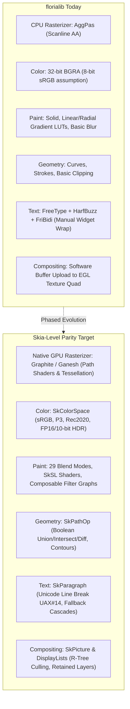
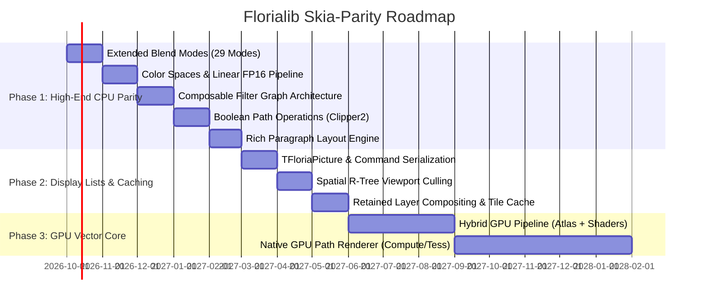

# Floria Graphics Architecture Roadmap: Evolution Toward Skia-Level Parity

## 1. Executive Summary & Vision

The objective of this roadmap is to establish a clear, phased engineering strategy to evolve **`florialib`**'s rendering and typography foundations (`Floria.Canvas.*`, `Floria.Font.*`, `Floria.SVG.*`) and **Floria Toolkit (`ft`)** into an industrial-grade 2D graphics engine comparable in capabilities and performance to **Google Skia** (the engine powering Chromium, Android, Flutter, Firefox, and Avalonia).

Today, `florialib` boasts a solid foundation:
- **`AggPas:2.4.0`**: A mathematically rigorous, sub-pixel accurate CPU 2D vector rasterizer decoupled from legacy frameworks.
- **Modern Typography Pipeline**: FreeType glyph caching, HarfBuzz text shaping (`Floria.Text.HarfBuzz`), and FriBidi bidirectional reordering (`Floria.Unicode.BiDi`).
- **W3C CSS & SVG Engines**: Complete push tokenizers, AST, selector matching, cascade solvers, and SVG path rasterization.
- **Hardware Presentation**: EGL 1.4/1.5 and OpenGL ES 2.0 streaming pipeline (`Ft.Backend.EGL`).

However, reaching "Skia level" requires overcoming architectural bottlenecks: transitioning from immediate-mode CPU rasterization to **retained display lists**, **native GPU path rendering**, **true color space pipelines (HDR/Linear sRGB)**, **arbitrary boolean path operations**, and **composable filter graphs**.

---

## 2. Architectural Comparison: Florialib vs. Google Skia

### Detailed Domain Gap Matrix

| Capability Domain | `florialib` Current State | Google Skia Benchmark | Gap Severity | Target Milestone |
| :--- | :--- | :--- | :--- | :--- |
| **Vector Rasterization** | CPU scanline rasterization via AggPas. | GPU path rasterization via compute shaders and tessellation (Ganesh/Graphite). | **Critical** | Phase 3 |
| **Color Spaces & HDR** | Fixed 32-bit BGRA (`TBgraPixel`, 8bpc), implicit gamma 2.2 approximation. | Arbitrary color spaces (`SkColorSpace`), ICC profiles, FP16 linear, 10-bit HDR, gamut mapping. | **High** | Phase 1 |
| **Blend Modes** | Porter-Duff `SrcOver`, alpha-blended strokes. | 29 Blend Modes (12 Porter-Duff + 17 Photoshop/W3C modes like Multiply, Screen, Overlay). | **Medium** | Phase 1 |
| **Shaders & Filter Graphs** | Linear and radial gradient LUTs, box blur, drop shadow generator. | Composable filter trees (blur, color matrix, lighting, morphology) + SkSL runtime shaders. | **High** | Phase 1 & 2 |
| **Path Geometry & Ops** | Path storage, cubic/quadratic beziers, stroke expansion, affine transforms. | Boolean path operations (`SkPathOp`: Union, Difference, Intersect, XOR), contour simplification. | **High** | Phase 1 |
| **Text & Typography** | FreeType + HarfBuzz + FriBidi glyph runs. Manual widget line wrap. | Multi-style rich text paragraph engine (`SkParagraph`), UAX #14 line breaking, font fallback chains, variable fonts, color emoji (COLR/CPAL). | **High** | Phase 1 |
| **Scene Graph & Caching** | Immediate mode rasterization into window buffer with dirty rectangles. | Retained command recording (`SkPicture`), spatial R-Tree indexing, thread-safe replay, layer tile caching. | **High** | Phase 2 |
| **Hardware Backends** | X11/XCB with EGL/OpenGL ES 2.0 texture streaming. | Vulkan, Metal, Direct3D 12, OpenGL ES, WebGPU. | **Medium** | Phase 3 |

### 2.2 Modern Paradigm Shift: Google Skia vs. Flutter Impeller

While **Skia** serves as our functional benchmark for mathematical completeness (W3C blend modes, color spaces, path ops, typography), **Impeller** serves as our modern architectural blueprint for GPU vector execution without frame drops.

#### Why Flutter Replaced Skia with Impeller

#### Detailed Architecture Comparison

| Architectural Dimension | Google Skia (Ganesh) | Flutter Impeller | Florialib Strategy (Phases 2 & 3) |
| :--- | :--- | :--- | :--- |
| **Origin & Purpose** | 20+ year general-purpose engine (browsers, OS compositors, PDF, print). | Modern UI engine written from scratch specifically to guarantee smooth 60/120 FPS. | UI & desktop compositing engine tailored for `shellsama` and `ft`. |
| **Shader Compilation** | **Runtime JIT via SkSL**: Dynamically compiles shaders on main thread on first encounter, causing 50–200ms frame drops ("shader jank"). | **Ahead-Of-Time (AOT)**: All shaders precompiled offline to SPIR-V / MSL; static Pipeline State Objects (PSOs). Zero runtime shader compilation. | **AOT Precompiled Shaders**: Fixed GLSL / SPIR-V shaders compiled ahead-of-time; zero runtime compilation jank. |
| **Path Rendering** | **Stencil-and-Cover & CPU Masks**: Multi-pass stencil winding or CPU mask rasterization fallback with texture atlas blitting. | **Direct Tessellation & Analytic AA**: Fast CPU/compute tessellation into triangle strips; single-pass draw directly into color target. | **Direct Tessellation**: Decompose paths into triangle strips with analytic coverage in fragment shaders. |
| **GPU API Heritage** | OpenGL 2/3 state machine heritage; Vulkan/Metal retrofitted as wrappers over legacy context model. | First-class **Metal & Vulkan** with explicit Command Buffers and Render Passes; optimized for TBDR GPUs. | Modern explicit pipeline built over EGL / Vulkan with minimal state switches. |
| **Pass Compositing** | Immediate mode stream; `saveLayer()` dynamically allocates offscreen FBOs on the fly. | **Retained `EntityPass` Tree**: Batches, coalesces, and reorders draws; minimizes expensive framebuffer swaps. | **Retained `TFloriaRenderPass` Tree** (Phase 2): Records entire frame before flushing to GPU. |

#### Architectural Tenets Borrowed from Impeller for Florialib:
1. **Never Compile Shaders at Runtime**: All vector strokes, rounded corners, gradient ramps, and blur passes must utilize a bounded set of precompiled fragment shaders with uniform buffers.
2. **Prefer Direct Tessellation over Multi-Pass Stencil**: Stencil buffers require multiple render passes and memory barriers. Direct triangulation allows drawing filled/stroked paths directly into the color buffer in a single pass.
3. **Coalesce Offscreen Layers into Unified Render Passes**: Minimize framebuffer swaps to keep GPU pipelines filled and ensure rock-solid 60/120 FPS desktop rendering.

---

## 3. Phased Implementation Roadmap

---

## 4. Phase Breakdown & Engineering Specifications

### Phase 1: High-End 2D CPU Parity (Months 1–6)
*Goal: Elevate the mathematical, colorimetric, and layout capabilities of `florialib` so that its CPU rasterizer matches Skia's feature set.*

#### 1.1 Extended Blend Modes (`Floria.Canvas.Blend`) — [COMPLETED]
- Implemented the full set of 29 standard blend modes:
  - **Porter-Duff & Arithmetic (14)**: `Clear`, `Src`, `Dst`, `SrcOver`, `DstOver`, `SrcIn`, `DstIn`, `SrcOut`, `DstOut`, `SrcATop`, `DstATop`, `Xor`, `Plus`, `Modulate`.
  - **Separable Color (11)**: `Multiply`, `Screen`, `Overlay`, `Darken`, `Lighten`, `ColorDodge`, `ColorBurn`, `HardLight`, `SoftLight`, `Difference`, `Exclusion`.
  - **Non-Separable HSL (4)**: `Hue`, `Saturation`, `Color`, `Luminosity` (W3C standard color transforms).
- Integrated directly with `Floria.Canvas.Agg` via `FloriaAggBlendAdaptor` (`pixfmt_custom_blend_rgba`) and updated `DrawImage` / `DrawImagePart`.
- Verified with 39 dedicated unit tests and full canvas integration tests (404/404 passing in `florialib`, 48/48 in `ft`).

#### 1.2 Color Management & Linear Float Pipeline (`Floria.ColorSpace`)
- Introduce `TFloriaColorSpace` with support for:
  - sRGB, Display P3, Rec. 2020, and Adobe RGB.
  - Transfer functions (sRGB IEC 61966-2-1, Linear, PQ ST 2084, HLG).
- Introduce high-precision pixel formats alongside `TBgraPixel`:
  - `TRgbaF16` (half-precision float for HDR).
  - `TRgbaF32` (single-precision float for color-correct grading).
- Perform color interpolation and alpha compositing in **linear light** rather than non-linear gamma space, eliminating dark fringing on anti-aliased boundaries.

#### 1.3 Composable Filter Graph (`Floria.Canvas.Filter`)
- Architect a clean, non-destructive filter tree:
  - `TFloriaImageFilter` base class with `Apply(Src: TFloriaImage; Bounds: TRect): TFloriaImage`.
  - Concrete implementations: `TBlurFilter` (Gaussian, Box, Dual-Kawase), `TColorMatrixFilter` (4x5 color transform matrix for saturation, contrast, tinting), `TDropShadowFilter`, `TDisplacementMapFilter`, `TMorphologyFilter` (Dilate, Erode).

#### 1.4 Boolean Path Operations (`Floria.Path.Ops`)
- Integrate or port an industrial-grade polygon and path clipping engine (such as Angus Johnson’s **Clipper2**) into `florialib`.
- Expose first-class boolean operations on `agg_path_storage` / `TFloriaPath`:
  - `PathUnion(PathA, PathB): TFloriaPath`
  - `PathDifference(PathA, PathB): TFloriaPath`
  - `PathIntersect(PathA, PathB): TFloriaPath`
  - `PathXor(PathA, PathB): TFloriaPath`
- Support path simplification, contour winding rule resolution (NonZero, EvenOdd), and offset polygon expansion.

#### 1.5 Rich Paragraph Layout Engine (`Floria.Text.Paragraph`)
- Decouple text wrapping and layout from GUI widgets into a standalone typography engine:
  - Unicode line breaking conforming to **UAX #14** (Unicode Line Breaking Algorithm).
  - Bidirectional text layout using the existing FriBidi binding (`Floria.Unicode.BiDi`).
  - Cascading font fallbacks (system emoji, CJK, Arabic, Latin glyph fallbacks).
  - Variable font axis manipulation (Weight, Width, Slant, Optical Size).
  - Color emoji rendering supporting `COLR`/`CPAL` vector tables and `CBDT`/`CBLC`/`sbix` embedded bitmaps.

---

### Phase 2: Retained Display Lists & Scene Graph Caching (Months 7–9)
*Goal: Prevent redundant CPU vector re-rasterization by introducing recording, culling, and layer caching.*

#### 2.1 Recorded Command Stream (`TFloriaPicture` / `TFloriaDisplayList`)
- Implement a serialization model for canvas calls:
  - `TFloriaPictureRecorder` records draw commands (`DrawRect`, `DrawPath`, `DrawText`, `PushClip`, `DrawImage`) into a compact byte stream.
  - `TFloriaPicture` encapsulates the recorded commands with an exact conservative bounding box.
  - Can be replayed onto any canvas (`TFloriaCanvasAgg` or a GPU canvas) without re-evaluating widget layout.

#### 2.2 Spatial Indexing & Viewport Culling
- Implement an **R-Tree** spatial acceleration structure for display lists.
- During paint traversal, query the dirty damage region against the R-Tree to instantly skip drawing off-screen or undamaged visual elements.

#### 2.3 Retained Layer Compositing & Frosted Glass Caching
- Introduce `TFloriaLayer`:
  - Cache rendered subtrees (e.g. complex blurred panels, static background decor) in dedicated backing stores.
  - Re-render the layer only when its underlying visual state is marked dirty, reducing frame paint overhead from milliseconds to a simple memory blit or texture quad.

---

### Phase 3: Hardware-Accelerated GPU Vector Core (Months 10–18)
*Goal: True hardware GPU vector acceleration for 60/120 FPS high-refresh-rate desktop applications.*

#### 3.1 The Hybrid GPU Approach (Immediate High-Value Step)
- Maintain AggPas for vector path and glyph generation on the CPU.
- Upload glyphs and static vector masks to a shared GPU texture atlas (`TFloriaGPUAtlas`).
- Move all presentation, layout positioning, tinting, gradients, drop shadows, and backdrop frosted-glass blurs 100% into **OpenGL ES / EGL fragment shaders**, removing CPU memory blitting bottlenecks entirely.

#### 3.2 Native GPU Vector Rasterizer (`Floria.Canvas.GPU`) — Impeller-Style Architecture
- Implement direct GPU path evaluation with guaranteed 60/120 FPS frame pacing:
  - **AOT Precompiled Shaders**: Precompile all fragment/vertex shaders ahead of time (offline SPIR-V/GLSL) into static Pipeline State Objects (PSOs), completely eliminating runtime shader compilation jank.
  - **Single-Pass Direct Tessellation**: Decompose curved paths into triangle strips with analytic coverage anti-aliasing directly in fragment shaders, avoiding multi-pass stencil buffers and CPU mask rasterization bottlenecks.
  - **Instanced Primitive Batching**: Batch rounded rectangles, outlines, gradients, and glyph quads into instanced vertex buffers.
  - **Compute Shader Tile Rasterizer**: Modern compute tile binning for arbitrary complex filled paths (inspired by Impeller & Vello).

#### 3.3 Multi-Platform Backend Abstraction
- Abstract GPU presentation across platforms:
  - Linux: Wayland/X11 via EGL + OpenGL ES 3.0 / Vulkan.
  - Windows: Direct3D 11/12 via ANGLE or native DXGI.
  - macOS: Metal / MoltenVK.

---

## 5. Summary of Recommended Next Steps

1. **Immediate (Sprint 1)**: Implement extended blend modes and gamma-correct linear color space blending in `Floria.Canvas.Agg`.
2. **Short-Term (Sprint 2–3)**: Port or bind **Clipper2** to deliver first-class boolean path operations (`Floria.Path.Ops`).
3. **Mid-Term (Sprint 4–6)**: Construct the standalone `TFloriaParagraph` engine with UAX #14 line-breaking and cascading font fallback.
4. **Long-Term**: Build the `TFloriaPicture` command recording pipeline and transition the EGL backend from a simple texture quad into a fragment-shader layer compositor.
